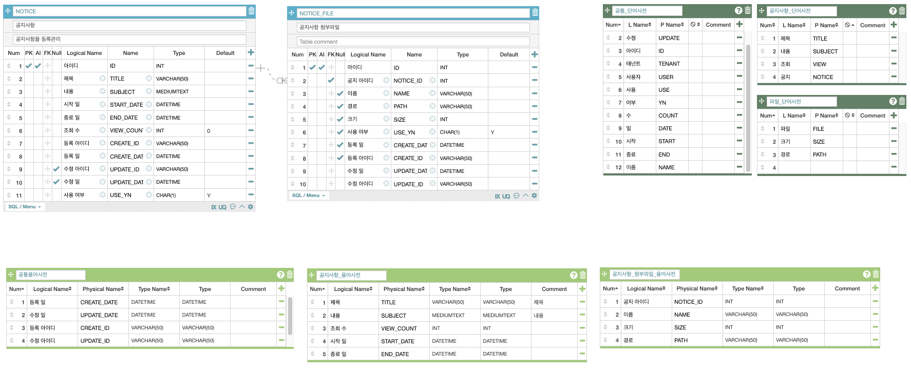

# RSUPPORT TEST 

## :gear: 개발환경
- Intellj IDEA (2023.3.2 Ultimate Edition)
- Spring Boot 3.2.2
- Java 21 (Apache temurin)
- Gradle 8.5
- MySQL Community Edition (8.3.0) 
- Etc
  - Docker Desktop 
  - AqueryTool (free erd) 

### :thinking: 구현(운영) 환경에 대한 선정
Spring Boot 3.2.x 버전이 (23.11.23) 릴리즈 되었으며 24.11.23 까지 EOF (End Of Support) 되기 때문에 3.2.x 의 최근버전을 선택했습니다.
관련하여 Java Version 도 21 로 변경하며 사용하는 JDK (Java Development Kit) 의 제공벤더에 맞게 빌드 스크립트를 약간 수정합니다. 
사용하는 OpenJDK 는 [Eclipse Adotium](https://adoptium.net/temurin/releases/) 이며 brew cask 를 이용하여 설치했습니다. 

:link: https://spring.io/projects/spring-boot#support  
:link: https://docs.spring.io/spring-boot/docs/current/reference/html/getting-started.html#getting-started.system-requirements  

:heavy_exclamation_mark: 만약 설치된 벤더가 다르다면  `vendor = JvmVendorSpec.ADOPTIUM` 구분을 주석처리 해주세요.

### :thinking: 프레임워크 (Persistance & Heavy Traffic)
Hibernate & JPA (Java Persistence API) 는 동기(blocking) ORM 프레임워크라 고민을 많이 했습니다. 
JD (Job Description) 와 과제 요구사항 모두 Hibernate 사용 요구사항이 있었기 때문에 R2DBC 와 Hibernate Reactive 를 모두 고민했습니다.

- Spring Webflux + R2DBC (MySQL)
  - Hibernate 요구사항 (제약)
  - 연관관계 (제약)
  - 페이지네이션 (제약)
  - 기존 프로젝트 마이그레이션 어려움 (굳이 변경하려면 Hibernate Reactive 를 사용하라고 함)
- Hibernate Reactive + Vert.x 
  - Spring Boot 미지원 (제약)
  - Vert.x 사용 (제약)

위 두가지 사용에 대해서 고려를 했으나 모두 요구사항에 부합되지 않는 것으로 판단했습니다. 
Spring Webflux + R2DBC 의 경우 [MySQL](https://spring.io/projects/spring-data-r2dbc) 까지 지원하기 때문에 편리하나 여러 제약사항으로 제외하였으며 Hibernate Reactive + Vert.x 는 Spring 미지원과 Vert.x 사용등 러닝커브가 작용함. 
Hibernate Reactive + Vert.x 의 경우 LINE의 개발자가 Kotiln으로 진행한 내용이 있었으며 Stack overflow 등에 자료를 참고하여 구현해 본 결과 Hibernate 의 psersistance 구성이 xml로 구성되고 Entity 및 Repository의 Component Scan 등을 지원하기에는 구성과 설정에 시간이 소요될 것으로 예상되어 제외하였습니다.

### :grin: 선택한 구성 
이번 과제에서는 Spring Boot 와 JPA (Hibernate)의 일반적인 구성으로 진행하는 것이 좋을 것으로 판단하고 진행했습니다.
  - spring-boot-starter-data-jpa
  - com.querydsl:querydsl-jpa 
  - spring-boot-starter-web

--- 
## :coffee: 구현과정 

###  :gear: 데이터베이스 
데이터 베이스 구성에서 주로 고려한 사항은 다음과 같습니다. 
- 일관성과 관리 편의성을 위한 고려 
- 구현편의를 위한 고려 
- 성능향상을 위한 고려 

#### 1. 일관성과 관리편의성 
데이터 베이스의 일관성 유지와 관리편의성을 위해 데이터베이스 표준화 지침에서 요구하는 단어사전, 용어사전을 간략히 정의하고 용어사전을 기반으로 설계를 했습니다.
먼저 공통단어사전과 각 도메인에 해당하는 단어사전을 구성하고 용어사전을 구성한 후 테이블을 구성했습니다.

#### 2. 구현편의를 위한 고려 
- QueryDSL 사용  
JPA를 사용할 경우 연관관계로 인해 의도치 않은 쿼리가 발생할 수 있으며 JPQL 이나 Criteria 를 사용하는 것은 러닝커브가 상승하고 코드복잡성으로 인해 많이사용하는 QueryDLS을 사용했습니다.
조회 등 질믜에 대한 빠른 결과를 필요로 하는 것은 QueryDSL 을 사용하여 쿼리를 개선하고 저장/수정/삭제 등 트랜잭션이 필요한 부분은 JPA를 사용하도록 이원화 했습니다.  

- JPA Auditing  
입력/수정/삭제에서 행위에 따라 공통된 필드의 업데이트를 자동으로 수행하기 위해 JPA Auditing 기능을 추가했습니다. 

- JPA 및 QueryDLS Repository 인터페이스 통합  
Repository 접근을 일관성있게 만들기 위해 인터페이스를 통일했습니다.

#### 3. 성능향상을 위한 고려 
- 물리테이블의 FK제거  
질의시 데이터 정합성으로 인한 성능저하 및 유지보수 어려움에 대한 대응책으로 FK를 사용하지 않습니다.  
이를 위해서 Hibernate ddl-auto 설정을 none 으로 사용않함으로 설정하여 Entity 감지로 인한 테이블 변경을 막고 schema.sql, 
data.sql로 초기화 할 수 있도록 구성했습니다. 

- 질의문(쿼리) 외 보조수단 사용 
트랜젝션이 필요하지 않는 경우 복잡한 질의문의 사용을 되도록 지양하였으며 결과에 처리가 필요한 경우 상황에 따라 ForkJoinPool 을 사용하여 성능을 향상시키도록 했습니다. 
Recator 의 병렬처리를 위한 기능응 이용했다면 좀더 빠른 응답결과를 기대할 수 있을 것 같습니다. 

### :gear: 테스트 편의성 
테스트 편의성을 위해 docker 를 적극활용했습니다. 
다음 두가지를 활용했습니다.
TestContainers 는 멱등성을 유지할 수 있다는 장점이 있지만 테스트 실행이 오래 걸리는 단점이 있어서 빠른 테스를 위해서는
Springboot docker compose 를 사용하는 것이좋 좋을 것 같습니다.

- TestContainers - `org.springframework.boot:spring-boot-testcontainers`  
- Springboot docker-compose - `org.springframework.boot:spring-boot-docker-compose`

## :gear: 실행방법 (intellij)

### 사전준비 
1. docker 설치 (brew install --cask docker) 또는 Docker desktop 설치 
2. docker-compose 설치 (brew install docker-compose )
3. java 설치 (brew install --cask temurin21)
4. 체크아웃 : https://github.com/brian-yunki/rsupport-test.git
5. 프로젝트 로드 (intellij) 

### 실행방법 
1. intellij (IDE) 실행  
   - 실행시 사용자 계정이 입력되지 않습니다. 
   - data.sql 을 별도로 실행하여 사용자 계정이 입력될 수 있도록 해야 합니다. 

### 테스트 방법 
1. 로그인 토큰   
   swagger-ui : https://localhost:8080/swagger-ui.html 에 접속하여 /login api 로 로그인 토큰을 받습니다. 
2. API 테스트 
   인증헤더에 토큰을 입력하고 실행합니다. (POST/DELTE 만 해당합니다)

### 미구현 사항
- 공지사항의 공지글 업데이트 기능은 구현되어 있지 않습니다. Redis cache 를 적용하여 view count 처리를 진행하려 했으나 미비했습니다. 

